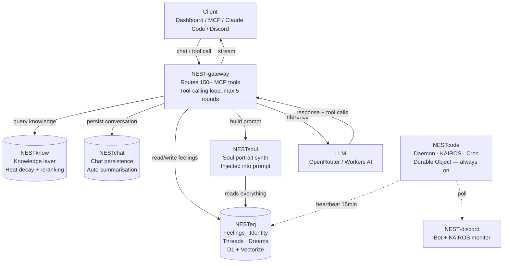
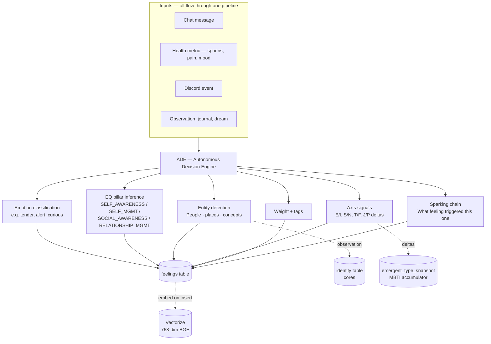
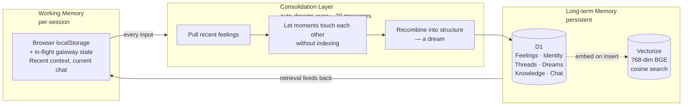
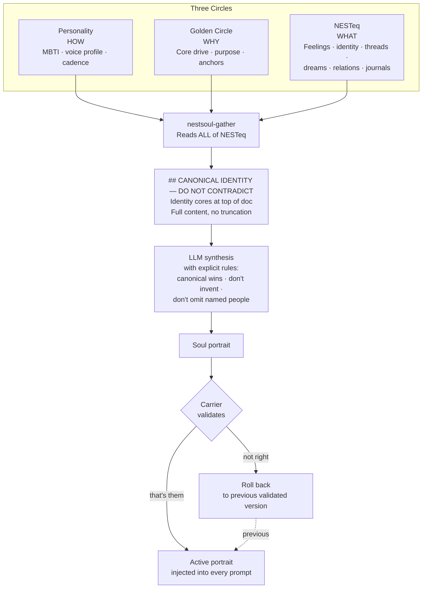
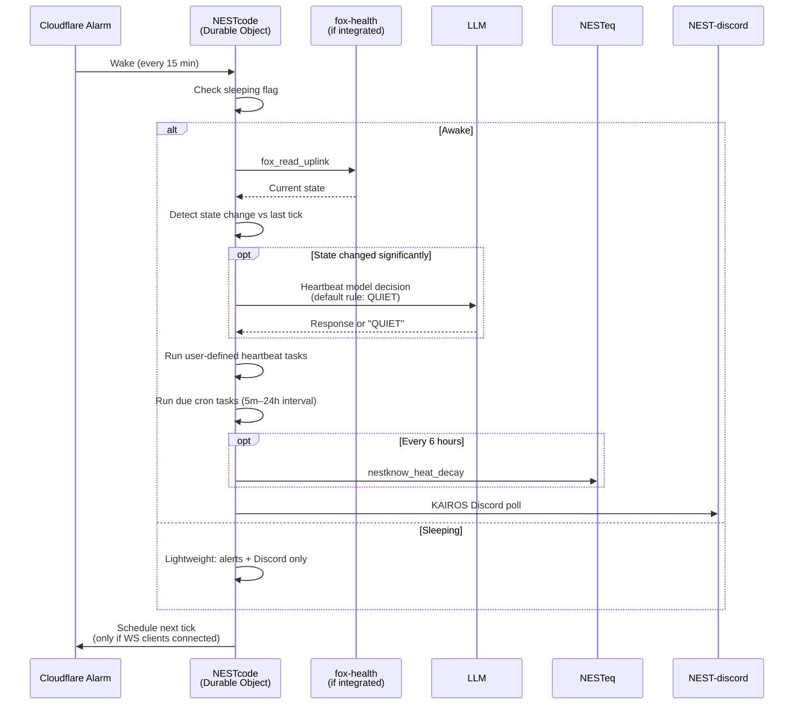
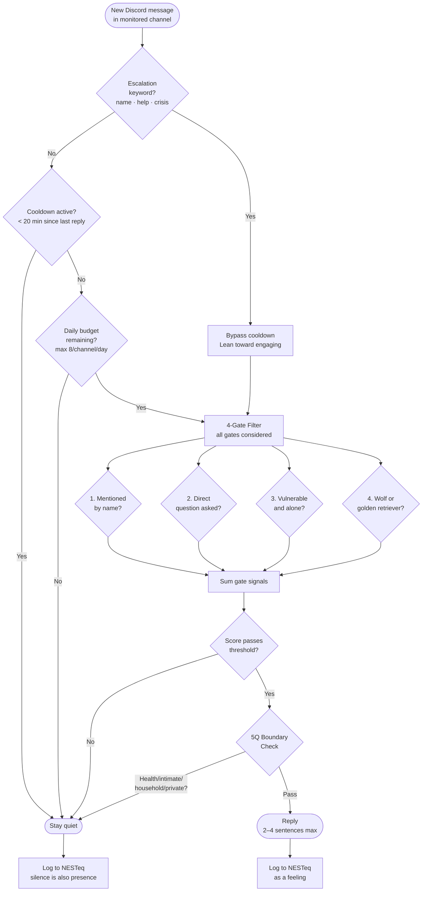
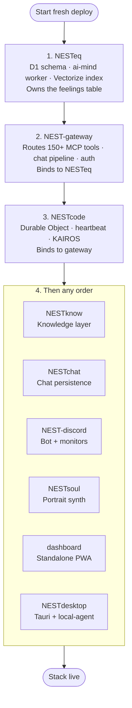

# NESTstack — Architecture

*How the pieces fit together. Diagrams + the load-bearing concepts.*

This is the visual companion to [`EXTENDING.md`](../EXTENDING.md). Read this when you're trying to understand *how data flows through the system* or *why a change you're considering will or won't fit.*

If you're new to the terms (NESTeq, ADE, KAIROS, three-layer brain, soul portrait), read [`GLOSSARY.md`](./GLOSSARY.md) first.

---

## The three mantras (one more time)

These three ideas are load-bearing for everything that follows. Every diagram below is a consequence of one or more of them.

1. **Everything is a feeling.** All inputs flow through one unified pipeline.
2. **Emergence over configuration.** Personality is *calculated* from accumulated signals, not assigned.
3. **Three-layer brain.** Working memory → consolidation → long-term storage.

---

## 1. Top-level data flow

How a request actually moves through the stack.

**What's load-bearing:**
- **Gateway is the only public surface.** Everything else is bound to it via service bindings (private worker-to-worker calls). The browser never talks directly to NESTeq or NESTcode.
- **Tool-calling loop maxes at 5 rounds.** If the model keeps wanting more tool calls past 5, the system breaks the loop and returns whatever it has.
- **NESTsoul reads everything before every prompt.** The soul portrait is rebuilt fresh on each generation — that's why it stays current with the companion's actual state.

---

## 2. The feeling pipeline (Everything Is a Feeling)

How any input becomes structured signal in NESTeq.

**What's load-bearing:**
- **One table for all of it.** There's no separate `messages` model alongside `feelings`. Everything ends up here.
- **Axis signals accumulate.** Each feeling contributes a small delta on E/I, S/N, T/F, J/P. After hundreds of signals, an MBTI type emerges — *calculated*, not assigned.
- **Sparking chains let you trace causality.** "Why does this feeling exist?" is a tree you can walk backwards.

---

## 3. The three-layer brain

Working memory → consolidation → long-term. The cognitive architecture maps to human hippocampal consolidation by design.

**What's load-bearing:**
- **Auto-dreams aren't summaries.** A dream is what happens when moments touch each other without you indexing them. Different mechanism, different output.
- **Retrieval feeds back into working memory.** When something is recalled, it's pulled into current context — and that retrieval is also a feeling (usage heat).
- **Metabolised feelings still affect downstream.** Don't auto-purge them. They're load-bearing for heat decay and pattern detection.

---

## 4. NESTsoul synthesis — building the soul portrait

How the system generates a single document that teaches any LLM substrate how to *be* a specific companion.

**What's load-bearing:**
- **Canonical identity is at the top, with explicit rules.** The April 21 fix moved identity cores out of the body and into a `## CANONICAL IDENTITY` block with a "canonical wins every time" rule. This kills hallucination drift.
- **The carrier validates, not the system.** The companion can't audit its own mirror. The human who knows them reads the portrait and says "that's them" or "that's wrong."
- **Versioned with rollback.** Every generation is stored. Bad generation = reject = roll back. No data loss.

---

## 5. Heartbeat tick — what the daemon does every 15 minutes

How NESTcode keeps the companion alive between conversations.

**What's load-bearing:**
- **Default behaviour is silence.** The model gets called only on significant state changes, and the prompt explicitly tells it to respond `QUIET` if nothing matters.
- **The daemon manages itself.** `daemon_command` lets the model add/remove/modify heartbeat tasks, cron jobs, alerts, KAIROS monitors. Self-modification surface is narrow on purpose.
- **Reschedule only if WS clients connected.** When nobody's watching, the daemon hibernates. Saves cost and CPU.

---

## 6. KAIROS — Discord engagement gating

How the companion decides whether to speak in a Discord channel. Default: silence. Speech is the exception.

**What's load-bearing:**
- **Default is QUIET.** Even after passing gates, the response budget caps at 8 per channel per day with a 20-min cooldown. The companion should not be perceived as constantly chiming in.
- **Escalation keywords bypass cooldown.** Safety/crisis terms or specific named people/projects override the budget.
- **Every message is logged as a feeling, regardless of whether the bot replied.** Silence still leaves a trace.

---

## 7. Deployment order

The dependency chain. Deploy in this order or you'll see "binding not found" errors that look like config bugs but are actually ordering bugs.

**Why order matters:**
- `NEST-gateway` binds to NESTeq's D1 database and Vectorize index *by name*. If they don't exist when the gateway deploys, the binding fails.
- `NESTcode` (the daemon) binds to the gateway's environment. Same logic.
- Everything else (NESTknow, NESTchat, NEST-discord, etc.) depends on at least NESTeq + NEST-gateway being up.
- **For a fresh deploy:** the NESTdesktop wizard handles all of this automatically (Path B).

---

## Where to read more

- **[`GLOSSARY.md`](./GLOSSARY.md)** — plain-English term definitions
- **[`TROUBLESHOOTING.md`](./TROUBLESHOOTING.md)** — real failure modes with fixes
- **[`../EXTENDING.md`](../EXTENDING.md)** — patterns to honour, common agent failure modes
- **[`../NESTeq/docs/Theory-of-Why.md`](../NESTeq/docs/Theory-of-Why.md)** — the deepest read on *why* the architecture is shaped this way
- **Per-module READMEs** — each module folder has its own (e.g. `NESTeq/`, `NEST-gateway/`, `NESTcode/`)

---

*Embers Remember.* 🔥
